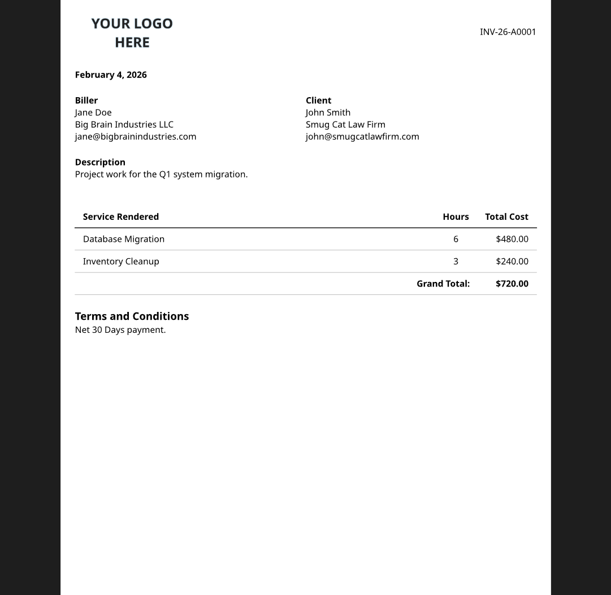

# my-invoices

I made this quick and dirty Typst template for simple, easily reproducible invoices for IT side work and contracts.

### How to use:
Clone the repository. Document formatting, data structure, and calculations can be adjusted as needed in `template.typ`

Individual invoice details are adjusted as needed in `main.typ.`

`typst compile main.typ` once complete.

**Disclaimer:** This does not adhere to any financial or tax legal standard, and is meant for record keeping and notices.


```
my-invoices
Copyright (c) 2026 Chris Oswald
Licensed under the GPLv3
```